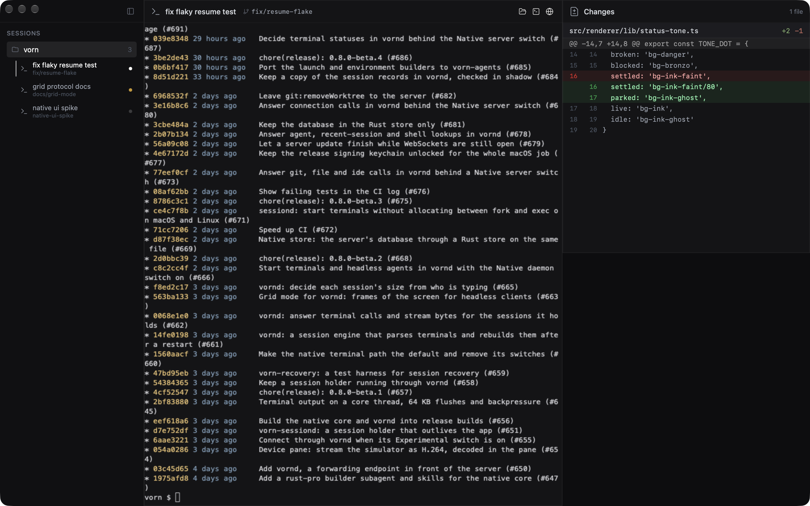
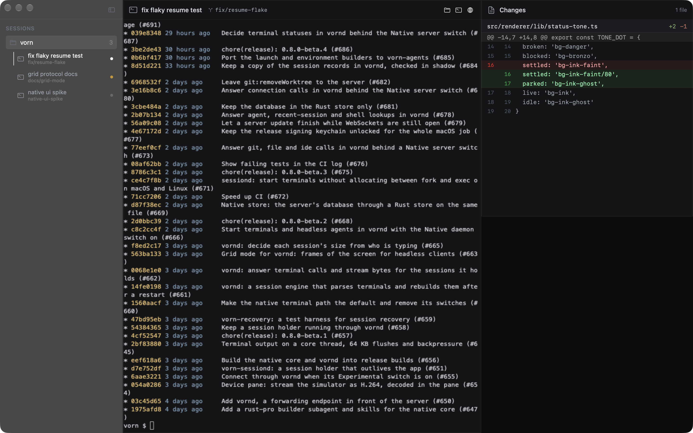
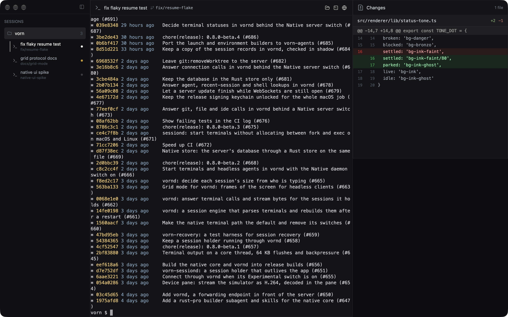
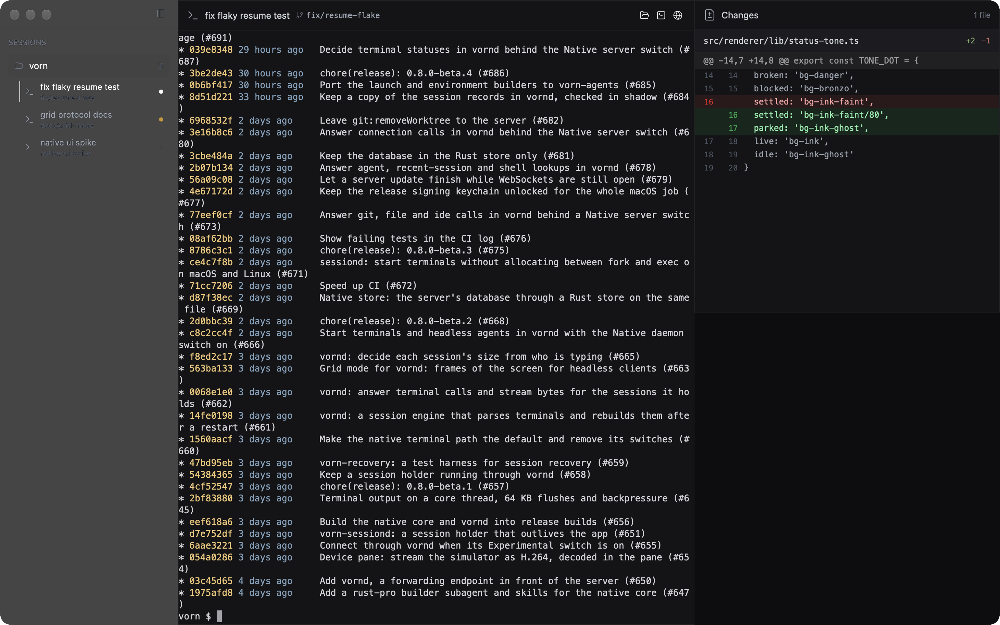
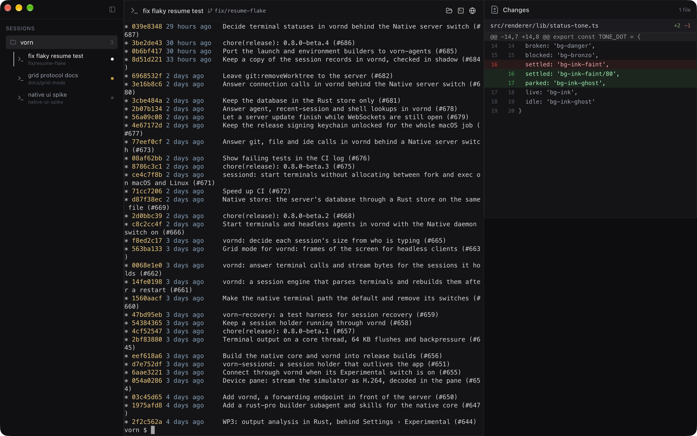
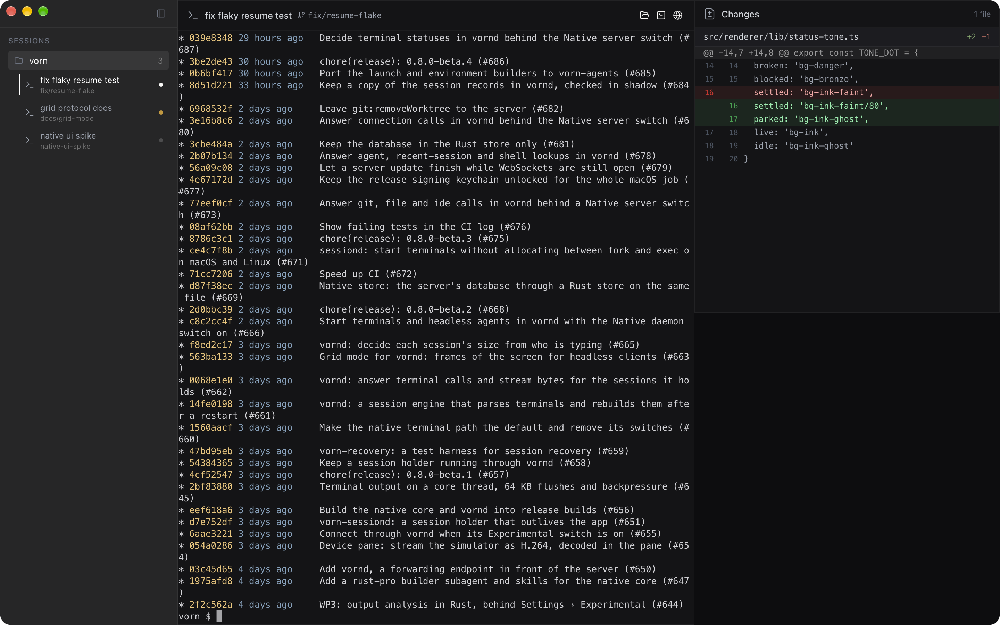
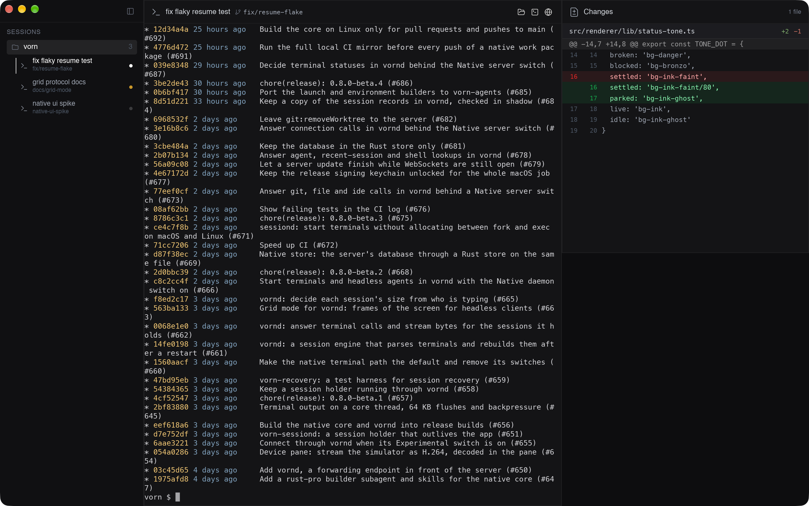
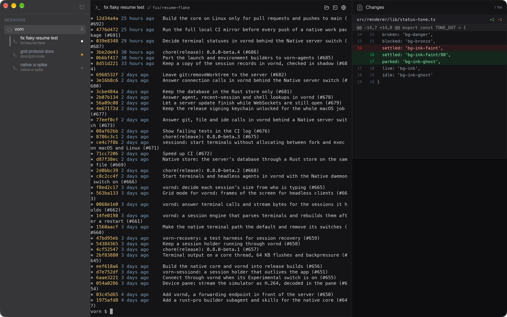

# Native desktop client spike: SwiftUI/AppKit vs GPUI vs Tauri vs Slint

This spike asks what Vorn's future thin desktop client should be built with. The client talks to vornd, draws terminals from vornd's grid protocol, adds a little chrome, and does no VT parsing.

It covers four candidates: SwiftUI/AppKit (macOS), GPUI (the Rust UI framework Zed is built on), Tauri (system webview with canvas drawing, no JS terminal emulator) and Slint. Each was built as a prototype, measured with one shared harness, and screenshotted building the same Vorn screen. Nothing here merges into the app.

**Recommendation: GPUI.** It had the best measurements on almost every row, and it is the only option that gives one Rust codebase for macOS, Windows and Linux. It links vornd's crates directly, and its text looks the same as AppKit's. The risks are real: there is no stable release, its accessibility support is young, and a browser pane needs a native webview embedded beside it. They are covered in [Recommendation](#recommendation).

## Contents

- [What was built](#what-was-built)
- [Methodology](#methodology)
- [Results](#results)
- [The look test](#the-look-test)
- [Qualitative assessment](#qualitative-assessment)
- [Slint license](#slint-license-for-an-mit-open-source-desktop-app)
- [Recommendation](#recommendation)
- [Not run yet: 16 and 32 panes](#not-run-yet-16-and-32-busy-panes-stress-plan-awaiting-approval)
- [Reproducing](#reproducing)

## What was built

All prototypes share the same Rust client, `core/` (`spike-core`). It:

- connects to `run/vornd-grid-<pid>.sock`;
- keeps a `term-mirror` screen per pane, decoded by `term-proto`'s CBOR codec;
- turns each dirty pane into a view of style runs (`view.rs`).

So decoding, credits and resize handling are identical across the four, and only the drawing layer differs. SwiftUI reaches the same code through a small C ABI static library, `ffi/`.

| Prototype | Path | Lines (UI layer, incl. look screen) | How it draws |
|---|---|---|---|
| SwiftUI/AppKit | `swift/` | 918 Swift | An AppKit `NSView` per pane, CoreText runs, `CADisplayLink`. SwiftUI for the look screen chrome. |
| GPUI | `gpui/` | 847 Rust | GPUI elements, shaped text runs, Metal. Zed commit `cb73ee1d45db3babb14f21efe83f229fcb334d99`, fetched sparse by `gpui/build.sh`. |
| Tauri | `tauri/` | 678 Rust + HTML/JS | Tauri 2.12 with WKWebView. Rust sends each view over IPC and JS draws it with `fillText` on one canvas per pane (devicePixelRatio 2). There is no VT parsing in JS. |
| Slint | `slint/` | 902 Rust + `.slint` | Slint 1.18.1 with the femtovg renderer and winit. Panes are a model of text runs drawn by `.slint` markup. |
| Shared | `core/`, `ffi/`, `harness/` | 1204 + 282 + 984 | Grid client, bench hooks, window capture, harness. |

Each prototype opens one window holding a grid of N panes. Each pane is attached to its own vornd session and shows monospace cells with their colours and the cursor. Each prototype also supports keyboard input, IME (for Slint, see the IME limitation below) and resize, plus a `--look` screen.

## Methodology

**Machine:** Apple M2 Pro, macOS 27.2, built-in 120 Hz Retina display, Swift 6.4, Rust release builds (`-j 3`).

**Isolation:**
- The harness (`harness/`) starts its own vornd and session holder with `--home` under `/tmp`.
- Each pane is a fresh session.
- The user's Vorn app and its server were never touched.

**Window:** every bench window is 1440×900 pt (2880×1800 px). AppKit normally shrinks a titled window to the visible frame, so all four override that.

**Runs:** each run is one process at a time and produces one JSON file in `results/raw/`. `spike-harness report` builds `results/summary.md` from them, and `results/table.md` (from `results/table.py`) is the condensed per-candidate table below. `bench.sh <client>` runs the matrix:

| Run | What happens |
|---|---|
| `latency-1` | 150 probes into one pane. |
| `latency-8-yes` | Probes into one pane while the other 7 run `yes`. |
| `idle-1`, `idle-8` | 10 s of idle panes. |
| `load-8-{yes,buildlog,rec_vim}` | 10 s with 8 busy panes. |
| `start-1-r1..5` | Five cold starts. |

**Keystroke-to-pixel latency:**
- The client injects a synthetic key event for a probe character into its own input path at a timestamp. The character travels to vornd, then to the session (`/bin/cat` echoes it), then back as a grid delta.
- The latency is the time until the frame that draws the probe glyph is presented: the frame callback after the draw that contains the probe cell, before the compositor.
- This is an in-process frame callback plus an echo through the shell, not a screen capture, because capturing 120 Hz frames from four toolkits the same way would add more noise than signal.
- Tauri's clock is in JS (`performance.now()`, which WebKit coarsens to 1 ms) up to `requestAnimationFrame`, so its numbers are not strictly comparable: the 1 ms rounding favours it on p50.
- "Lost" means probes whose frame never arrived within the timeout.

**Frames:**
- Each client records its frame intervals and its own frame work time (the time spent building and drawing the frame on the main/render thread).
- Dropped frames are the refreshes missed between consecutive frames, `round(interval / period) − 1`, summed over the measuring window. The period is the display's: 8.3 ms at 120 Hz.
- Under load, content is always pending, so every missed refresh is a real drop.

**Load producers (`harness/src/produce.rs`):**

| Producer | What it is | What its numbers mean |
|---|---|---|
| `yes` | Coloured `yes`, paced at 1 MB/s per pane. | Every frame of every pane is a new full screen. |
| `buildlog` | A scrolling compile log with an in-place spinner, at 256 KB/s. | |
| `rec:vim` | A recorded `crates/recovery` transcript replayed at its recorded pace. | Its bursty cadence means "fps/drops" there measure the recording, not jank, so treat that row as informational. |

**CPU and memory:**
- `harness/src/sample.rs` samples every 250 ms. Values are average CPU% over the run, and the peak of `phys_footprint` (the system's "Memory" figure for a process) and of RSS.
- For Tauri, the out-of-process WebKit helpers (WebContent, GPU, Networking) are added to the client, because they are part of what the client costs.
- vornd's CPU over the same window is recorded too, as a control. It should be equal across clients, and it is roughly equal: 56–68% for `yes` ×8.
- The lower vornd numbers under the slower consumers (Tauri at 60 Hz, Slint) are consistent with grid-mode credits throttling deltas to what the client takes, but that was not verified separately.

**Cold start:** time from `exec` of the client to the first frame in which every pane has its screen. The table reports the median of 5.

**Size:** the release binary (or `.app` bundle) on disk, not stripped further, in `results/sizes.txt`.

**Spaces caveat:**
- The machine had a full-screen remote-desktop Space. Windows on a non-active Space are not rendered by SwiftUI/AppKit or GPUI, which would make any frame numbers garbage.
- Every run records `on_screen` (checked through the window server list), and `bench.sh` stops on `false`. All results kept are `on_screen: true`.

**Tauri 60 Hz cap:**
- WKWebView paces `requestAnimationFrame` near 60 fps by default, even on a 120 Hz display.
- `tauri` is the stock behaviour. `tauri120` flips WebKit's internal `PreferPageRenderingUpdatesNear60FPSEnabled` feature flag off through a private API (`tauri/src/main.rs`, `unlock_120`). That is not something to ship without risk, but it shows what the webview can do.

## Results

### Per-candidate table

All panes are in one 1440×900 window on a 120 Hz display. N=8 is the largest size measured so far; see the stress plan below for 16/32.

| Metric | SwiftUI/AppKit | GPUI | Tauri (stock, 60 Hz) | Tauri (120 Hz flag) | Slint | Electron (today) |
|---|---|---|---|---|---|---|
| Latency p50 / p95, 1 pane (ms) | 5.8 / 9.4 ¹ | 4.8 / 8.1 | 2.0 / 7.0 ² | 4.0 / 6.0 ² | 8.4 / 10.3 | n/m |
| Latency p50 / p95, 1 pane + 7 panes of `yes` (ms) | 7.0 / 8.8 | **1.3 / 8.1** | 26 / 33 | 14 / 17 | 7.9 / 13.0 | n/m |
| `yes` ×8: fps / dropped | 120 / 0% | 119.6 / 0.3% | 60 / 50% ³ | 120 / 0% | 119.8 / 0.2% | n/m |
| `yes` ×8: frame work p50 / p95 (ms) | 2.6 / 2.7 | 1.5 / 1.7 | 1.0 / 2.0 ² | 1.0 / 1.0 ² | 4.9 / 5.1 | n/m |
| `buildlog` ×8: fps / dropped | 119.8 / 0.2% | **120 / 0%** | 60 / 50% ³ | 120 / 0% | 96.9 / **12.5%** | n/m |
| `buildlog` ×8: frame work p50 / p95 (ms) | 4.1 / 4.4 | 2.0 / 2.5 | 2.0 / 3.0 ² | 2.0 / 2.0 ² | 7.8 / 8.3 | n/m |
| `rec:vim` ×8: fps / interval p95 (ms) ⁴ | 76 / 35 | 104 / 17 | 60 / 18 | 112 / 17 | 89 / 25 | n/m |
| Client CPU %, idle 8 panes | **0.4** | 1.7 | 7.7 | 2.2 | 2.9 | n/m |
| Client CPU %, `yes` ×8 | 36.5 | **32.4** | 55.0 | 140 | 74.4 | n/m |
| Client CPU %, `buildlog` ×8 | 53.7 | **40.2** | 62.4 | 153 | 95.9 | n/m |
| Client memory footprint MB, idle 8 / `yes` ×8 | **24 / 34** | 71 / 106 | 113 / 218 | 111 / 429 | 149 / 179 | n/m |
| Client RSS MB, idle 8 / `yes` ×8 | 94 / 99 | 91 / 88 | 172 / 232 | 172 / 348 | 101 / 109 | n/m |
| vornd CPU %, `yes` ×8 / `buildlog` ×8 (control) | 66 / 28 | 68 / 27 | 56 / 26 | 64 / 26 | 56 / 24 | n/m |
| Cold start to first frame, median of 5 (ms) | 205 | **164** | 513 | 516 | 449 | n/m |
| Binary / bundle (arm64) | **0.8 MB** `.app` | 7.1 MB | 6.1 MB | 6.1 MB | 13 MB | 164 MB zip / 171 MB dmg (v0.7.5 release asset) |

Notes:

1. **SwiftUI latency.** The first `swift-latency-1` run lost 63 of 150 probes: the window drew only 89 frames in the run. A rerun (`results/raw/swift-latency-1-rerun.json`) lost 3, at p50/p95 7.1/10.1 ms. The cause is a pause/unpause race in the prototype's `CADisplayLink` driver (`swift/main.swift`, `Driver.frame`). The waker's async unpause can land before the frame callback re-pauses the link on an empty dirty set, so the link sleeps until the next wake. This is a prototype bug, not a platform limit. The p50/p95 of the probes that arrived are plausible, but treat SwiftUI latency as "about 6–7 ms p50".
2. **Tauri timing.** Tauri times frames and latency in JS with 1 ms resolution up to `requestAnimationFrame`, and the compositor and WebContent→UI hop are not included. Read its latency and frame work as lower bounds.
3. **Tauri 60 Hz.** The stock webview caps rendering near 60 Hz. The "50% dropped" is that cap counted against a 120 Hz display, not hitches: frames are a steady 16.7 ms. At 60 Hz, keystroke latency under load becomes 26/33 ms because the probe waits behind the busy panes' canvas work within one rAF.
4. **`rec:vim`.** The recording's own cadence drives these numbers, so they are not a jank measure.

**Electron: not measured.** n/m = not measurable the same way:
- Today's app does not speak the grid protocol. Its renderer runs a JS terminal emulator fed raw PTY bytes over its Node server, so it does its own VT parsing. The latency and frame numbers would compare a different pipeline.
- It has no bench hooks (probe injection or frame callback) to record what the harness records.
- Running a second instance against an isolated vornd would mean launching the user's app binary while the user's own instance and server are running, which this spike was told never to do.

Its size comes from the published v0.7.5 release assets. Its runtime numbers need a dedicated run on a machine where the app can be started in isolation.

Raw data:
- `results/raw/*.json`: one file per run, with per-sample series;
- `results/summary.md`: every run, every column, including WindowServer CPU;
- `results/table.md`;
- `results/sizes.txt`.

### What the numbers say

- **GPUI and SwiftUI/AppKit are in a class of their own for drawing.**
  - Both hold 120 fps with ≈0 drops at 8 busy panes, in 1.5–4.4 ms of frame work. That leaves headroom for 32 panes.
  - GPUI is the cheaper of the two in CPU (32–40% against 37–54% for 8 full-screen-per-frame panes) and keeps latency flat under load (p50 1.3 ms with 7 busy panes).
  - SwiftUI/AppKit is far cheaper in memory (24–34 MB against 71–106 MB) and near-free at idle (0.4%).
- **Tauri works when idle but under load pays for the webview.** That shows as 55–62% CPU at 60 Hz, or 140–153% when unlocked to 120 Hz. It needs 218–429 MB, because the canvas backing stores live in WebContent and GPU helper processes. At the stock 60 Hz, typing latency under load is 26/33 ms, 3–4× the native options. Its cold start is 2.5–3× slower (webview spin-up).
- **Slint draws correctly but is the most CPU-hungry native option.**
  - The femtovg renderer re-tessellates text each frame: 74–96% CPU, and 7.8 ms frame work on the build log, close to the 8.3 ms budget. That is where its 12.5% drops come from.
  - Its binary is the largest (13 MB) and its cold start is 449 ms.
  - Slint's Skia renderer would likely do better but adds a large C++ dependency. It was not tried within the spike's build limits.
- **vornd costs the same under every client**, within noise: 56–68% for `yes` ×8 and 24–28% for `buildlog` ×8. As intended, the server side is not a differentiator.

## The look test

All four prototypes run `--look` and build the same Vorn screen at 1440×900 on a Retina display (2880×1800 px captures):
- a sidebar with the "Sessions" header, a project row and three session rows (name, branch, agent icon, status dot);
- a session card with header (title, branch chip, three neutral icon buttons with tooltips) holding a **live vornd terminal** running `git log --graph --color` on this repo;
- a smaller card with a few diff lines.

Tokens were copied from `src/renderer`:

| Element | Values |
|---|---|
| Backgrounds | `#0d0d0f` app, `#101012` sidebar, `#141416` card |
| Borders | `rgba(255,255,255,.06)` |
| Text | `#faf9f7`, plus `#9ca3af` / `#6b7280` / `#4b5563` greys |
| Fonts | system UI 11/12/13 px; Menlo 12 px for terminal and diff |
| Rows and spacing | sidebar 255 px wide, rows 16/14 px line height, 8 px grid |
| Status dots | the app's tone colours |

Icons are the app's own SVGs (`look/icons/`).

Design rules applied: no gradients, no shadows, radius ≤ 4 px, neutral icon buttons, dark theme.

Deviations from the real app:
- the app uses a 6 px radius on some surfaces, here capped at 4;
- a few paddings are 12/10 px where the app has them, which is off the 8 px grid.

"With platform polish" is each framework's closest native finish:

| Framework | Polish |
|---|---|
| SwiftUI | `NSVisualEffectView` `.sidebar` material behind the sidebar, plus SF Symbols for the icons |
| GPUI | `WindowBackgroundAppearance::Blurred` with a translucent sidebar |
| Tauri | the window's native `Sidebar` effect under a transparent webview |
| Slint | winit transparent and blurred window with a translucent sidebar |

| | Plain | With platform polish |
|---|---|---|
| SwiftUI/AppKit |  |  |
| GPUI |  |  |
| Tauri (canvas) |  |  |
| Slint |  |  |

Files are in `results/look/`. Each PNG has a `look-*.json` alongside with its capture metadata (`on_screen: true` for all eight).

### Notes on the look

**Text crispness and font rendering**

- **SwiftUI/AppKit, GPUI and Tauri are effectively indistinguishable.** All three rasterize through CoreText at 2×: GPUI via font-kit/CoreText and a Metal glyph atlas, Tauri via WebKit's canvas `fillText`. Glyph weight, hinting and kerning of Menlo and the system font match pixel for pixel at a glance. macOS no longer does subpixel (LCD) AA, so none of them do; all use grayscale AA at 2×.
- **Slint is visibly different.** femtovg rasterizes glyphs itself, so text is slightly thinner and lighter. That is most visible in the 13 px medium card title and the sidebar names. Its terminal line height also comes out tighter (two more rows fit), and it wraps the git log one column earlier: it measures cell width from a probe `Text`, which rounds differently. It is acceptable, but the one you notice side by side.

**Alignment**

- All four land on the same layout to within a pixel or two, since they share tokens.
- GPUI's flex layout matched the CSS version almost line for line.
- In SwiftUI, the `HStack`/`VStack` spacing and the default padding had to be zeroed explicitly. Otherwise rows drift by 2–4 px.
- The traffic lights look grey in the SwiftUI and GPUI shots only because those bench windows were not key at capture time. This is not a rendering difference; the cursor is hollow for the same reason.

**How close each got to the real app**

- **Tauri is closest by construction.** It is the same CSS, the same fonts and the same SVGs as the Electron renderer. A full client could reuse the app's React components for everything except the terminals.
- **GPUI and SwiftUI/AppKit are next and essentially equal.** Each needed the tokens re-expressed in code.
- **Slint is close in layout but off in text weight.**

**Polish**

- **SwiftUI's sidebar material is the most "native"-looking result.** It picks up the desktop behind the window, it is what macOS users expect, and it costs one line.
- **Tauri's native sidebar effect is equally real**, the same `NSVisualEffectView`.
- **GPUI's blurred background works** but blurs the whole window: every opaque surface must be repainted on top. The dim branch text becomes hard to read on the translucent sidebar and would need a contrast pass.
- **Slint's winit blur works similarly**, with the same contrast caveat.
- **None of the polish variants breaks the design rules.**

**Effort for the look screen**

| Prototype | Size | Relative effort | Notes |
|---|---|---|---|
| Tauri | ≈150 lines of CSS/JS in `dist/index.html` | Least | Easiest, being plain CSS. |
| GPUI | `gpui/src/look.rs` ≈300 lines | Low | The `div()` builder API reads like utility CSS and was the easiest native one. Tooltips are built in. |
| SwiftUI | `swift/look.swift` ≈330 lines | Medium | Fast for chrome. Precise pixel control fights SwiftUI's defaults: padding, `.help` tooltips, the font metrics of `Text`. Hosting the AppKit terminal view inside needs `NSViewRepresentable`. |
| Slint | ≈300 lines of `.slint` markup plus glue | Highest | No tooltip API (a hover popup stands in). The hidden `TextInput` used for keyboard focus needed workarounds to stay focusable. |

## Qualitative assessment

| | SwiftUI/AppKit | GPUI | Tauri (canvas) | Slint |
|---|---|---|---|---|
| **Text quality** | CoreText, reference quality | CoreText (mac), DirectWrite (Windows), cosmic-text (Linux); matches AppKit on mac | CoreText through WebKit; WebView2 and WebKitGTK elsewhere differ | Own femtovg rasterizer, slightly thin; Skia backend optional |
| **Ligatures** | Yes (CoreText shaping) | Yes (Zed ships them) | Font-default ligatures only; canvas has no font-feature control | Shaped by Slint's text stack; not tested |
| **Emoji / wide chars** | Yes (CoreText colour emoji) | Yes (colour emoji atlas) | Yes | Not verified in this spike |
| **IME (Japanese)** | Full `NSTextInputClient`; the prototype draws marked text at the cursor | Full platform input handler (`EntityInputHandler`, `setMarkedText`); the prototype implements it | Hidden `<textarea>` with `compositionend`; the preedit is shown by the OS candidate window, not inline | Hidden `TextInput` composes; preedit is not drawn at the terminal cursor (limitation) |
| **Accessibility** | Best: `NSAccessibility`. The prototype's pane is a text area whose value is the screen text. iOS/iPadOS reuse. | AccessKit integration landed in GPUI at the pinned commit (`window/a11y.rs`, example `a11y.rs`); young and not wired in this prototype | The webview's accessibility tree, but a `<canvas>` is opaque to it, so terminal text needs a hidden ARIA text mirror | AccessKit built in for standard widgets; a custom terminal needs its own nodes |
| **Cross-platform** | macOS (and iPadOS/iOS with work) only; Windows and Linux each need a separate client, ×3 UI codebases | One codebase: macOS (Metal), Windows (DirectX), Linux (Vulkan/wgpu, X11 and Wayland); proven by Zed on all three | One codebase, but three different webviews (WebKit, WebView2, WebKitGTK), whose canvas performance and quirks differ, WebKitGTK being the weakest | One codebase, three OSes plus embedded |
| **Browser pane** | `WKWebView`, native and trivial | No webview element; embed a native webview (e.g. wry) as a child window and keep it in sync with layout | Native: it is a webview | No webview element; embed natively as with GPUI |
| **Diff review, editor, workflow canvas** | Rebuild everything natively. An editor is a large project; `NSTextView` gets you partway. | Rebuild natively. Zed's editor is GPUI and shows the path, but most of Zed outside `gpui` is GPL/AGPL, so it is reference, not reusable code, for an MIT app. A full editor is still a large project. | Reuse the existing React UI and its editor components, the cheapest path by far | Rebuild natively; text-editing widgets are basic |
| **Ecosystem and stability** | Stable, Apple-paced | No crates.io release; pin a git commit, with API churn on bumps; docs thin, Zed's source is the docs | Stable 2.x | Stable 1.x; license see below |
| **License** | Apple SDK | Apache-2.0 | MIT/Apache-2.0 | Royalty-free 2.0 / GPLv3 / commercial |
| **Build** | `swiftc` plus a Rust static lib, fast | Heavy first build (Metal shaders, many crates); fine incrementally | Moderate | Moderate; `.slint` compile step |

**Effort to reach the full app** (panes, diff review, editor, workflow canvas, browser pane), roughly:

- **Tauri: least effort.** Keep the React renderer and swap the JS terminal emulator for the canvas grid view. But this is largely today's Electron app with a different shell, and it keeps the webview's memory and CPU costs.
- **GPUI: large effort.** Rebuild the UI natively in Rust, once for all three OSes. Zed proves every part of it at scale (editor, diff, panes, Windows and Linux). The browser pane is the one native embed.
- **SwiftUI/AppKit: large effort per platform.** The best Mac result, but the same rebuild again for Windows and Linux in two more toolkits and languages.
- **Slint: large effort.** Its widget set and text editing are thinner, and the measured per-frame cost is highest.

## Slint license (for an MIT open-source desktop app)

Slint is triple-licensed:
- **Slint Royalty-free Desktop, Mobile, and Web Applications License 2.0**;
- **GPLv3**;
- a **commercial** license.

An MIT-licensed open-source desktop app can use Slint for free under the Royalty-free 2.0 license if it gives attribution: show Slint's `AboutSlint` widget (e.g. in an About dialog) or put a "Made with Slint" badge on the app's website or download page.

The app's own code stays MIT, but the Slint library inside the shipped binary stays under Slint's license, not MIT. Embedded-device use is not covered by the royalty-free license.

GPLv3 is the alternative, but it would make the combined distributed app GPL.

## Recommendation

**GPUI**, for the cross-platform thin client.

### Deciding reasons

1. **Best measured client.** Under load it has the lowest CPU, the flattest latency and zero drops at 120 Hz:
   - 32–40% CPU for 8 panes that redraw fully every frame;
   - 1.3/8.1 ms latency with 7 busy panes;
   - 1.5–2.5 ms frame work.

   It also has the fastest cold start (164 ms) and a 7 MB binary. The headroom points at 32 panes being comfortable; to be confirmed by the stress run.
2. **One codebase for three OSes.** It is native on each (Metal, DirectX, Vulkan) and proven there by Zed, which ships a terminal and an editor on all three. SwiftUI/AppKit would mean three clients in three languages.
3. **Rust end to end.** The client links `term-mirror`, `term-proto` and any other vornd crate directly, with no C ABI and no IPC to a renderer process. The same code could later move logic out of the server.
4. **It looks as good as AppKit**, since it uses the same CoreText rasterization on macOS. It matched the app's design tokens with the least fighting of the native options, and IME is implemented through the platform's text input client.

### Why not the others

- **SwiftUI/AppKit** is the best Mac citizen: the least memory, the best accessibility and IME, and real materials. It is the pick if Vorn becomes macOS/iPadOS-first and accepts separate Windows and Linux clients. The Electron app ships on all three today, so that is a large ongoing cost.
- **Tauri** is the cheapest path to the full app, because it reuses the React UI. But it measured 1.5–4× the CPU and 2–4× the memory of GPUI, the stock webview caps at 60 Hz (unlocking it uses a private WebKit flag), and typing latency under load was 26 ms. Its cross-platform story is three different webviews. It is closest to "Electron with a lighter shell", which only partly answers why to go native.
- **Slint** worked and has a clear license path (attribution required), but drew the least efficiently (74–96% CPU, 12.5% drops on the build log), had the thinnest text, and the least mature text editing for the editor and diff surfaces.

### Risks of the GPUI pick, and mitigations

| Risk | Mitigation |
|---|---|
| **No stable release.** Pinned to a Zed commit; APIs change between bumps and docs are thin. | Vendor the pin, bump on a schedule (e.g. quarterly), and keep the GPUI-touching layer thin over a framework-neutral view model, as `spike-core`'s `view.rs` already is. |
| **Accessibility is young.** AccessKit landed upstream but is new, and VoiceOver support for a custom terminal element must be built (screen text as a text area, as the SwiftUI prototype does). | Budget it explicitly. It is a gating requirement, not polish. |
| **Browser pane.** GPUI has no webview. | Embed a native webview (wry or a platform view) as a child window and sync its frame with GPUI layout. Prototype this early: it is the riskiest integration. |
| **Full-app effort.** Diff review, editor and workflow canvas must be rebuilt natively. | Zed's source shows how, but it is the largest line item regardless. Consider shipping the native client terminal-first and keeping the web UI for complex surfaces until replaced. |
| **Upstream priorities.** GPUI evolves for Zed's needs. | Its Apache-2.0 license allows forking if it diverges. |
| **Windows and Linux not measured here.** | Repeat this harness on Windows (DirectX) and Linux (Wayland) before committing. |

## Not run yet: 16 and 32 busy panes (stress plan, awaiting approval)

Runs above N=8 are stress runs and were held back for the maintainer's go-ahead. The plan:

- **Clients:** `gpui`, `swift`, `slint`, `tauri`, `tauri120`, one client at a time, in that order.
- **Per client:**
  - `load-16-yes`, `load-16-buildlog`, `load-32-yes`, `load-32-buildlog` (10 s each);
  - `latency-32-yes` (150 probes into one pane while 31 run `yes` at 1 MB/s);
  - `idle-32` (10 s).
- **Pacing:** each run is a single `timeout 150` process with a 60 s cool-down between runs. That is about 10 min per client, about 50 min in total.
- **Load:** 32 producers at 1 MB/s plus vornd at an expected 200–250% CPU, plus the client.
- **Command:** `bench.sh` with N raised, i.e. `spike-harness run --client <c> --mode load --panes 32 --producer yes --name <c>-load-32-yes`.

## Reproducing

```sh
cd spikes/native-ui
cargo build --release -j 3 -p spike-harness -p vorn-spike-tauri -p vorn-spike-slint
./gpui/build.sh            # fetches the pinned Zed commit into .deps/ and builds
./swift/build.sh           # builds ffi/ as a static lib, then the .app
./bench.sh gpui            # the N<=8 matrix for one client
VORN_SPIKE_WEBVIEW_120=1 ./bench.sh tauri tauri120
./target/release/spike-harness run --client swift --mode look [--polish] --name look-swift
./target/release/spike-harness report    # writes results/summary.md
python3 results/table.py > results/table.md
```

vornd and the session holder come from `packages/core` release builds. The harness starts them with an isolated `--home` under `/tmp`.
