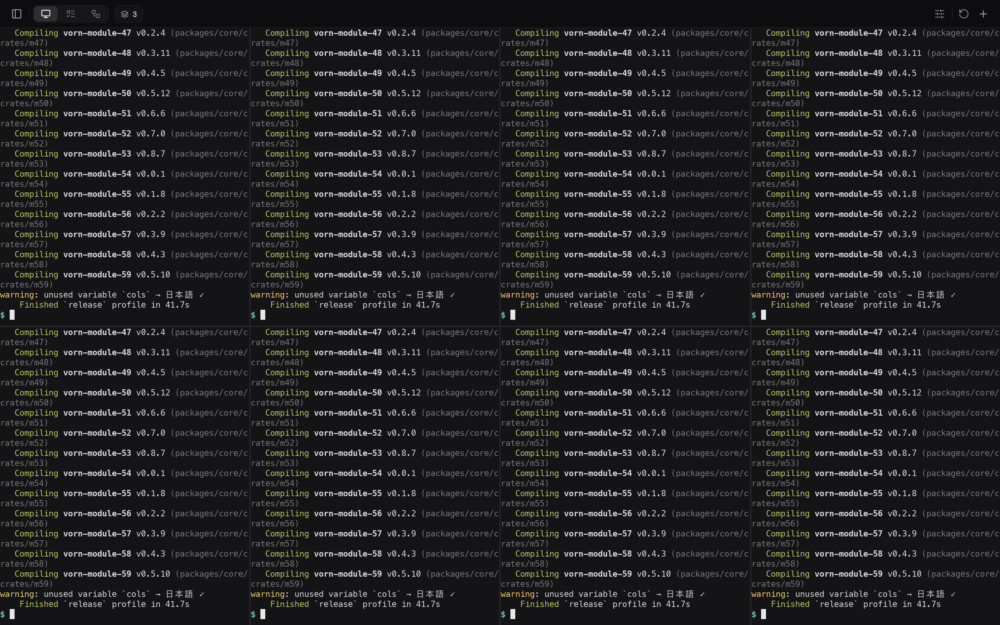
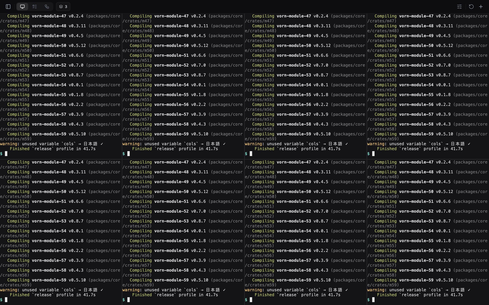
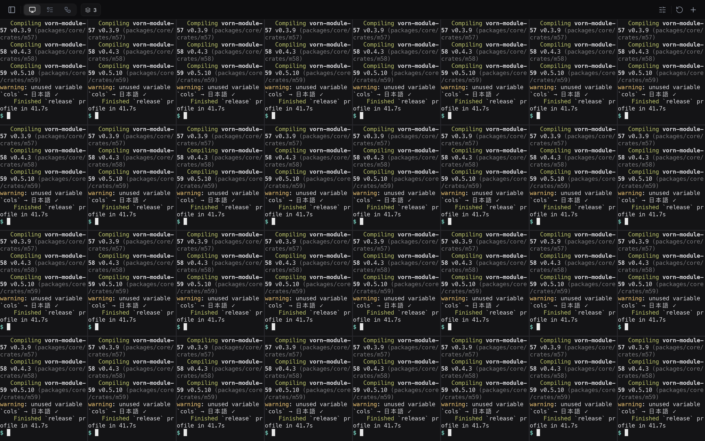
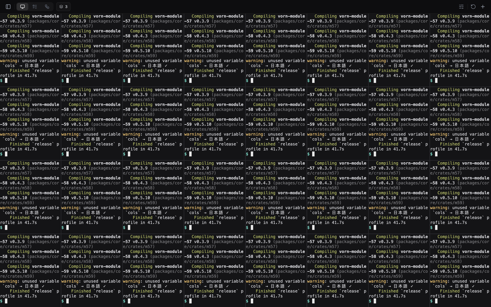
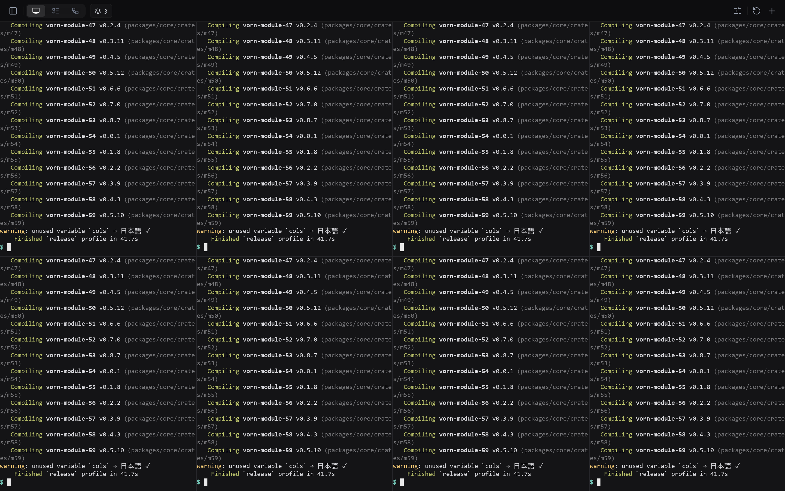
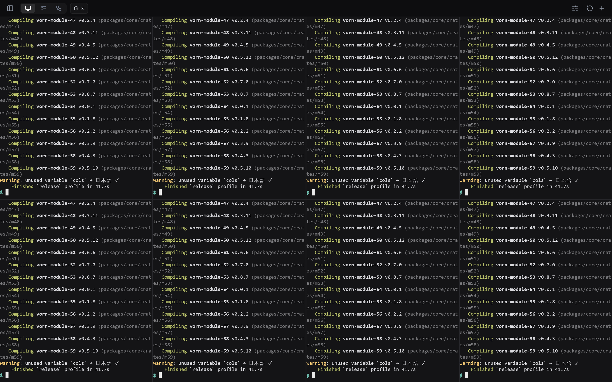

# vornui spike: GPUI or a thin UI layer of our own

The question: should the Windows/Linux UI be built on GPUI, or on vornui, a
thin layer of our own made only from general crates (winit, wgpu,
cosmic-text + swash, taffy, AccessKit, resvg)?

To answer it, both prototypes draw the same two things:

- today's main screen: top bar with icon buttons, the terminals/tasks/workflows
  pill switch, sessions chip, gold logo, and the composer with chips and the
  send button, using the values from `src/renderer/theme.css` and the
  components;
- a terminal view drawing vornd's cell grid (`grid-client`, `term-mirror`,
  `term-proto`) for 8 and 32 busy panes, fed by a test vornd started in a
  temp directory.

Both share one harness (`shared/`) for the daemon, load, grid mirroring,
layout values, metrics and the bench loop. Only the UI layer differs.

## Recommendation

**Build vornui.** It is the better base for Vorn's Windows and Linux UI,
with two conditions taken on as the first work:

1. a GPU-less (software adapter) rendering path that is not much slower
   than GPUI's. On Windows' software adapter today, vornui renders the
   8-pane grid at about 3 fps against GPUI's 27 (see Windows below);
2. latency pacing that matches GPUI's tight tail.

Both are now met by `packages/core/crates/vornui`, the layer promoted out of
this spike (see "After the spike" below).

Why vornui:

- **Cheaper at the same frame rate.** On the Mac it uses about half of
  GPUI's CPU at 8 and 32 busy panes (24% and 15%, against 45%), with 3–6×
  lower CPU frame time and a lower peak RSS (28 MB, against 39–43 MB).
- **Half the dependency tree, and only general crates.** 175 crates
  against 328. Nothing has to be patched: GPUI's headless and IME hooks
  needed 83 lines of patches to a pinned checkout, and its Windows
  backends are split (DX11 for windows, wgpu for offscreen).
- **Control over the hard parts Vorn cares about.** Those are the terminal
  grid, IME composition in a pane, and the accessibility tree, and vornui
  owns all three. The layer is 2,154 lines and the app on top is 767 lines,
  against 1,012 for the same app on GPUI.

GPUI wins on things that are real but fixable on our side:

- a tighter latency tail and faster cold start (95 ms against 236 ms on the
  Mac);
- in the spike, a far faster software-rendering path on the Windows
  runner: 27 fps against 3 fps at 8 panes, with a keystroke-to-pixel p50
  of 119 ms against 674 ms (the promoted crate now draws 44 fps there,
  with a 54 ms p50; see Windows below). Its memory there is the cost:
  574 MB peak RSS against 85 MB, and a 5.8 s cold start against 0.47 s;
- a widget and focus model we would otherwise have to write.

These are the risks that would change the answer:

- vornui's software-adapter rendering cannot be brought close to GPUI's;
- the widget work below grows past a few thousand lines.

## Screens

Today (Electron, 1440×900 at 2×; onboarding skipped, sidebar closed, no
sessions so no sessions chip, agent chip relabelled "Agent"):

| vornui (macOS) | GPUI (macOS) |
|---|---|
|  |  |
|  |  |
|  |  |
|  |  |

| vornui (Windows) | GPUI (Windows) |
|---|---|
|  |  |
|  |  |

HiDPI shots at 1× and 1.5× are in `results/*/*-main-1x.png` and
`*-main-1.5x.png`; both prototypes lay out in logical pixels and
rasterize text and icons at the device scale.

GPUI's mono cell comes out slightly wider than vornui's, from the Menlo
advance as GPUI measures it, so its lines wrap a few columns earlier. Each
is consistent within its own layout.

## Results

### macOS: Apple M2 Pro, Metal, 1440×900 at 2×

vornui's columns are the promoted crate: on Metal, and with the CPU
rasterizer forced (`VORNUI_RENDERER=cpu`). GPUI's are from the spike run.

| | vornui | vornui, CPU raster | GPUI |
|---|---|---|---|
| **8 busy panes**, frame p50 / p95 / p99 | 1.10 / 2.21 / 3.16 ms | 2.84 / 3.90 / 5.23 ms | 3.40 / 4.04 / 4.18 ms |
| keystroke-to-pixel p50 / p95 / p99 | 3.43 / 4.92 / 5.25 ms | 2.62 / 4.24 / 5.40 ms | 8.24 / 9.22 / 10.25 ms |
| fps, lost probes | 115.0, 0 | 117.5, 0 | 108.7, 0 |
| CPU | 23.3% | 101% | 44.5% |
| peak RSS / phys footprint | 27.8 / 80.2 MB | 37.8 / 27.4 MB | 39.3 / 52.4 MB |
| **32 busy panes**, frame p50 / p95 / p99 | 0.65 / 1.69 / 2.90 ms | 1.85 / 2.11 / 3.11 ms | 3.28 / 3.53 / 3.69 ms |
| keystroke-to-pixel p50 / p95 / p99 | 3.16 / 4.64 / 4.75 ms | 1.23 / 1.97 / 6.27 ms | 8.28 / 9.08 / 9.42 ms |
| fps, lost probes | 112.0, 4 | 116.5, 4 | 109.4, 4 |
| CPU | 17.1% | 66% | 45.4% |
| peak RSS / phys footprint | 28.3 / 81.6 MB | 37.2 / 28.1 MB | 43.1 / 53.7 MB |
| static redraw, main 2× p50 / p99 | 1.28 / 1.69 ms ¹ | 0.12 / 0.15 ms | 0.21 / 0.40 ms |
| static redraw, grid 8 p50 / p99 | 1.69 / 2.10 ms ¹ | 0.32 / 0.45 ms | 1.19 / 1.43 ms |
| static redraw, grid 32 p50 / p99 | 1.86 / 2.93 ms ¹ | 0.41 / 0.66 ms | 1.83 / 2.05 ms |
| cold start to first frame of 8 panes, p50 of 5 | 252 ms | | 95 ms |
| IME (Japanese): preedit drawn, commit reaches the pty | yes, `$ 日本語` | | yes, `$ 日本語` |
| a11y tree (main / grid) | 20 / 13 nodes, terminals carry screen text | | 19 / 13 nodes, terminals carry screen text |
| HiDPI 1× / 1.5× / 2× | yes | | yes |
| release binary | 9.3 MB | | 10.7 MB ² |
| lines we own: UI layer / app | 7,422 (with widgets, window, CPU raster) / 856 | | 83 lines of patches / 1,012 |
| dependency crates | 178 (layer alone 148) | | 328 |

¹ vornui's redraw loop waits for the previous frame's GPU work, as a
swapchain would, so the number is GPU throughput for the 2880×1800 target.
GPUI's Metal path commits without waiting, so its number is CPU time only.
Before the wait was added, vornui's CPU-only redraws were 0.41 ms (main),
0.38 ms (grid 8) and 0.38 ms (grid 32) at p50. In the paced benches the
GPU is idle by the next frame, so the wait costs nothing there.
Frame p50 was 1.06 and 0.63 ms before the change, and 1.05 and 0.57 ms
after.

² GPUI is built with its test-support feature, which carries the headless
platform.

### Windows: windows-2022 runner, Hyper-V, no GPU (WARP)

vornui's column is the promoted crate, which picks its CPU rasterizer on
this software adapter and presents through WARP. Both columns are from the
same run.

| | vornui | GPUI |
|---|---|---|
| **8 busy panes**, frame p50 / p95 / p99 | 22.5 / 27.5 / 33.2 ms | 10.0 / 13.3 / 31.3 ms ¹ |
| keystroke-to-pixel p50 / p95 / p99 | 54 / 71 / 80 ms | 260 / 487 / 496 ms |
| fps, lost probes | 43.9, 0 | 29.5, 1 |
| CPU | 94% | 343% |
| peak RSS / private bytes | 115 / 314 MB | 580 / 957 MB |
| **32 busy panes**, frame p50 / p95 / p99 | 132 / 168 / 174 ms | 12.8 / 45.5 / 154 ms ¹ |
| keystroke-to-pixel p50 / p95 / p99 | 282 / 403 / 414 ms | 765 / 964 / 965 ms |
| fps, lost probes | 8.0, 2 | 30.5, 1 |
| CPU | 25% | 291% |
| peak RSS / private bytes | 126 / 314 MB | 727 / 1,092 MB |
| static redraw, main 1× / 1.5× / 2× p50 | 0.19 / 0.19 / 0.19 ms | 1.6 / 1.6 / 1.7 ms ¹ |
| static redraw, grid 8 p50 / p99 | 0.43 / 0.79 ms | 10.6 / 138 ms ¹ |
| static redraw, grid 32 p50 / p99 | 0.53 / 0.79 ms | 13.2 / 168 ms ¹ |
| cold start to first frame of 8 panes, p50 of 5 | 774 ms (740–1,259) | 3,720 ms (3,557–4,229) |
| IME (Japanese): preedit drawn, commit reaches the pty | yes, `$ 日本語` | yes, `$ 日本語` |
| a11y tree (main / grid) | 20 / 13 nodes | 19 / 13 nodes |
| release exe | 12.2 MB | 19.8 MB ² |

¹ GPUI queues GPU work without waiting, so its frame and redraw times are
CPU-only; its backlog shows up in latency and memory instead. vornui's
frame time covers the raster, the upload and the wait for the previous
present. ² as in the macOS table.

The runner has no GPU, so both prototypes draw through Windows' software
DX12 adapter (WARP). These are numbers for a GPU-less machine (a VM or a
remote session), not for a desktop with a graphics card. Keystroke-to-pixel
latency, fps, memory and cold start are comparable across the two.

At 8 panes vornui now draws 1.5× GPUI's frames, with a fifth of its median
latency and a sixth of its p99, at under a third of its CPU and a fifth of
its RSS. The spike's vornui managed 2.95 fps and 674 ms here. At 32 panes
vornui's latency is still lower than GPUI's, but it draws 8 fps against 30:
its frames spend most of their time waiting, at 25% CPU, rather than
rasterizing, so the time goes to the upload and present through WARP and
not to drawing. That is the next thing to look at on this adapter.

## After the spike

The layer now lives in `packages/core/crates/vornui`; this spike's app
builds on it. The two conditions:

1. **Software rendering.** When the adapter is a software one (WARP,
   llvmpipe), vornui draws on the CPU instead: a tiled rasterizer on a few
   threads that redraws only the tiles whose content changed, keeps glyph
   and icon masks in the same atlases, and uploads only the damaged rows to
   the GPU to present. A frame where nothing changed costs a scene compare.
   On the Windows runner's WARP adapter the 8-pane grid went from 2.95 to
   43.9 fps (GPUI: 29.5) and its keystroke-to-pixel p50 from 674 to 54 ms.
   On the Mac it runs the 8-pane bench at 117 fps with a 2.8 ms frame p50;
   the crate's `raster` bench draws the 8-pane grid at 2880×1800 in 1.18 ms
   when every pixel changes, 0.36 ms when one pane does and 0.19 ms when none
   does. A GPU and CPU parity test checks that both draw the same widgets.
2. **Pacing.** A `Pacer` remembers a keystroke waiting for its echo; the
   first frame after the typed-into pane changes is drawn at once instead of
   on the next display slot. On the Mac the keystroke-to-pixel p50 went from
   9.66 ms to 3.43 ms at 8 panes, and the p99 from 11.3 to 5.2 ms, below
   GPUI's 8.24 / 10.25 ms. The bench driver skips its 120 Hz slot only while
   the prototype says it is waiting for an echo.

The crate also has the app's widgets (buttons, icon buttons with tooltips,
pills, pickers with dropdown menus, text input and composer with IME and
clipboard, lists, split panes, scroll views and tabs), each with AccessKit
nodes and keyboard focus, and a window runner (winit surface, IME cursor
area, AccessKit adapter and actions, system clipboard).

## How it was measured

- `scripts/measure.sh <binary> <name> <out>` runs every mode for one
  prototype. The CI workflow `.github/workflows/vornui-spike.yml` runs it on
  windows-2022 and uploads the JSON and PNGs.
- **Daemon.** Each run starts the released vornd (v0.8.0-beta.7) with its
  own temp `HOME` and `--data-dir`, and kills it and its sessiond on exit.
- **Load.** Busy panes run a producer that writes colored lines at 1 MB/s, so
  every pane has a new screen every frame. The probe pane echoes keys in raw
  mode, and screenshots use a few idle screens of a build log.
- **Frame time.** Each frame is timed from its start to the GPU submit,
  covering pulling dirty panes, building, layout and encoding. The bench
  paces frames like a 120 Hz display and renders offscreen into a texture,
  with no window.
- **Keystroke-to-pixel.** The driver types into pane 0 through the
  prototype's own input path. Each key arms a probe on the grid client, and
  its latency ends at the submit of the first frame that draws its glyph.
- **CPU** is user+sys over the 20 s run, for the prototype process only (not
  vornd or the producers). **RSS** is peak resident; on the Mac, the
  physical footprint is also reported.
- **Cold start** is a fresh process with the daemon already up, through
  GPU init, fonts and grid attach, to its first complete frame of 8 panes.
- **IME.** Composition events are injected the way the OS IME would
  deliver them: through winit `Ime` events for vornui, and through GPUI's
  platform input handler. No OS IME window is driven.
- **a11y.** vornui builds an AccessKit tree; GPUI uses its accessibility
  tree, with the test window acting as if a screen reader were connected.
  Both dumps are in `results/*/*-a11y.json`.
- **GPUI** is a sparse checkout at a pinned commit (`gpui/fetch_zed.sh`).
  `gpui/patch_zed.py` makes four test-support changes:
  - present frames headless;
  - expose the IME input handler;
  - activate the a11y tree;
  - set the test window's scale, and enable DX12 for its wgpu headless
    renderer.

  On Windows, the prototype takes its text system from the windowed
  platform, because the headless one has no text system.

Caveats:

- IME and screen-reader support are verified as plumbing, not with a real
  IME or screen reader.
- Linux was not run. vornui's winit has X11 and Wayland disabled to keep
  the build small, and GPUI on Linux is its wgpu renderer.
- The earlier windowed GPUI numbers (1.3 ms p50 typing, 32% CPU, 106 MB at 8
  panes) came from a different harness and are not comparable with these.

## What vornui still needs to be complete

- Real OS windows checked by hand on all three platforms; the runner
  exists but tests only draw offscreen.
- Widgets: undo in text fields, horizontal scrolling in the tab strip, and
  tooltip fades.
- Terminal: selection, scrollback scrolling, links, and wide and combining
  glyphs beyond what the spike draws.
- Rendering:
  - the 32-pane grid on WARP (8 fps against GPUI's 30; the frames wait on
    upload and present, not on the raster);
  - an atlas eviction policy;
  - color emoji;
  - subpixel positioning checks against today's text.
- Linux: X11 and Wayland, fontconfig fallback, and portal IME.
- A theming layer that reads the same tokens as `theme.css`.
